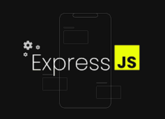
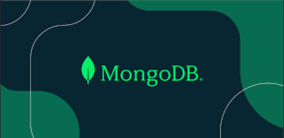

# Shaken-not-Stirred

---

Shaken not Stirred is the brain-child of James Eckman, Emily Ramirez and Efrain Del Campo. We were thinking how that whether in stressful times or times to celebrate, your favorite cocktail (if you're of age) sometimes just pairs perfectly with the current situation. That said, Shaken not Stirred is an alcoholic recipe sharing app where people around the globe can share their favorite drink recipes along with what experiences they go best with. The following features of the app is what makes it a platform that brings people together and potentially can help personal drink experiences live on forever.

- Add a picture of your favorite cocktail.
- Add a detailed list of ingredients and detailed instructions
  on how to mix them.
- Entries can be seen by the public, enhancing the experience of their next party, celebration, or perhaps just the end of a long day at work.
- Sign up with a unique user name and password.
- Login capability that allows you to create personal profiles, saving their favorite recipes and preferences.
- This also allows for enhanced security, user engagement, analytics and content management.
- Lastly, this can set up the ability to add notifications and updates to users about new recipes or comments.

---

## Table of contents

- [Installation](#Installation)
- [Technologies Used](#Technologies-Used)
- [Contributing](#Contributing)
- [License](#License)
- [Documentation](#Documentation)
- [In Summary](#In-Summary)

## Installation Instructions

In order to install this app, follow these simple instructions:

1. Clone the applications github repo.
2. Navigate to the client directory in your IDE.
3. Enter the command `npm i`
4. Enter the command `npm start` to run the program.

---

## Technologies Used

- Node.js. This is the runtime environment I used in conjunction with my IDE to code this project. You can download the current version of node.js [here](https://nodejs.org/en)
- 
- Express.js a server-side web app framework used to build RESTful APIs with Node.js. Take a look at their [documentation](https://expressjs.com/).
  
- MongoDB is the document database we used that stores both structured and unstructured data. Check out their website [here](https://www.mongodb.com/lp/cloud/atlas/try4-reg?utm_source=google&utm_campaign=search_gs_pl_evergreen_atlas_core_retarget-brand_gic-null_amers-us-ca_ps-all_desktop_eng_lead&utm_term=mongodb&utm_medium=cpc_paid_search&utm_ad=e&utm_ad_campaign_id=14291004479&adgroup=128837427347&cq_cmp=14291004479&gad_source=1&gclid=Cj0KCQiA_qG5BhDTARIsAA0UHSI3-zWap1GPOB7qphDOHT2tCLieZv1xygoP_WLEGmY7Qvx0x0Ofl7oaAozzEALw_wcB).
  
- React is the free/open source javaScript library we used for the rendering of the front end of this project. Check out their [website](https://react.dev/).
  

---

## Contributing

The following are some ways in which you can participate in this project:

- Submit bugs and feature requests, and help verify as they are checked in
- Review source code changes
- Review the documentation and make pull requests for anything from typos to refactoring to additional and new content.

## License

- This is licensed under the MIT license

## Documentation

The following resources will help you as they helped us understand and build a quality MERN stack application:

- [Codefinity's article on GraphQL](https://codefinity.com/blog/Web-Development-with-GraphQL)
- [W3School's MongoDB tutorial](https://www.w3schools.com/mongodb/) for examples as well as step-by-step instructions.
- [NPM's website for node packages](https://www.npmjs.com/package/inquirer/v/8.2.4)
- [Programming With Mosh's YouTube video titled "React Tutorial for Beginners](https://www.youtube.com/watch?app=desktop&v=SqcY0GlETPk)

## In-Summary

Sometimes, you just need a drink. Help us help everyone unwind a little bit, celebrate birthdays, create new holiday traditions, or maybe just help get through some tough times. The user/community feedback for this project could be what makes it sink or swim. First impressions are the most important, and I hope we've made a good one on you.

- Email Efrain, Emily or James with any questions at the following email addresses:
  Efrain: efraindelcampo17@hotmail.com
  Emily: emilyramirez218@gmail.com
  James: jeckman722@gmail.com
